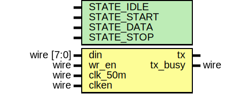
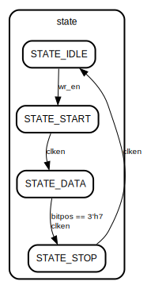

# Entity: transmitter 

- **File**: transmitter.v
## Diagram

## Generics

| Generic name | Type | Value | Description |
| ------------ | ---- | ----- | ----------- |
| STATE_IDLE   |      | 2'b00 |             |
| STATE_START  |      | 2'b01 |             |
| STATE_DATA   |      | 2'b10 |             |
| STATE_STOP   |      | 2'b11 |             |
## Ports

| Port name | Direction | Type       | Description |
| --------- | --------- | ---------- | ----------- |
| din       | input     | wire [7:0] |             |
| wr_en     | input     | wire       |             |
| clk_50m   | input     | wire       |             |
| clken     | input     | wire       |             |
| tx        | output    |            |             |
| tx_busy   | output    | wire       |             |
## Signals

| Name   | Type      | Description |
| ------ | --------- | ----------- |
| data   | reg [7:0] |             |
| bitpos | reg [2:0] |             |
| state  | reg [1:0] |             |
## Processes
- unnamed: ( @(posedge clk_50m) )
  - **Type:** always
## State machines

