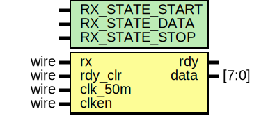
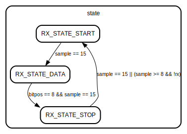

# Entity: receiver 

- **File**: receiver.v
## Diagram

## Generics

| Generic name   | Type | Value | Description |
| -------------- | ---- | ----- | ----------- |
| RX_STATE_START |      | 2'b00 |             |
| RX_STATE_DATA  |      | 2'b01 |             |
| RX_STATE_STOP  |      | 2'b10 |             |
## Ports

| Port name | Direction | Type  | Description |
| --------- | --------- | ----- | ----------- |
| rx        | input     | wire  |             |
| rdy       | output    |       |             |
| rdy_clr   | input     | wire  |             |
| clk_50m   | input     | wire  |             |
| clken     | input     | wire  |             |
| data      | output    | [7:0] |             |
## Signals

| Name    | Type      | Description |
| ------- | --------- | ----------- |
| state   | reg [1:0] |             |
| sample  | reg [3:0] |             |
| bitpos  | reg [3:0] |             |
| scratch | reg [7:0] |             |
## Processes
- unnamed: ( @(posedge clk_50m) )
  - **Type:** always
## State machines

